<h1>Smart Home Control System</h1>
<h1>Задание 1.1</h1>
Текущее монолитное решение представляет собой веб сервис написанный на Java.  
Данный сервис позволяет осуществлять управлять отопительными устройствами по их идентификатору. Идентификация пользователя при управлении устройством не осуществляется, это говорит о том, что существует возможность контроля чужих устройств.  
В качестве хранилища данных использует реляционная база данных - PostgreSQL. 
Диаграмма контекста C4 (все последующие изображения диаграмм содержат гиперссылки на plantUML-файл): 

  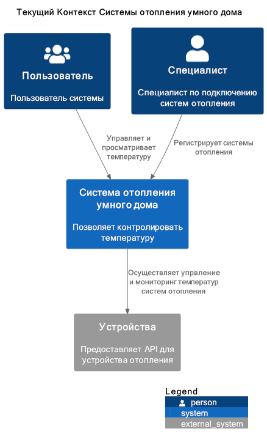

 

# Задание 1.2
По причине объёмов информации данного задания - реализация, по умолчанию, свёрнута.

<h2>Диаграмма контейнеров</h2>
 
<h3>Диаграмма целевой архитектуры решения на уровне контейнеров</h3> 
В качестве способа коммуникации между сервисами используется хореография (только потому, что в рамках предыдущих спринтов использовал оркестрацию).

  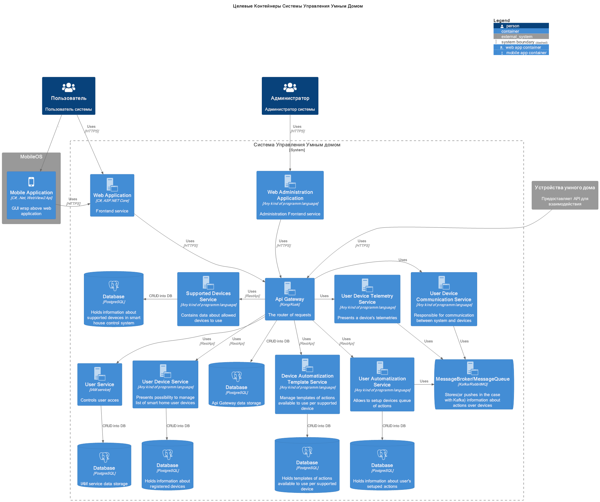

 

 

<h2>Диаграммы компонентов</h2>

<h3>Диаграмма целевого состояния компонента ApiGateway</h3> 
Вся коммуникация с внешним миром осуществляется исключительно через данный сервис. 

  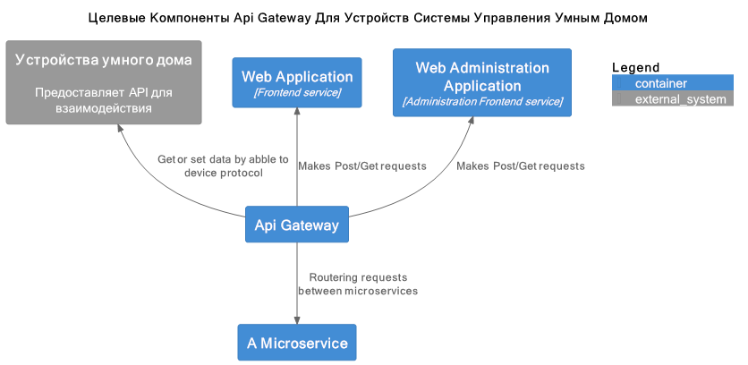

 

<h3>Диаграмма целевого состояния компонента SupportedDeviceService</h3> 
Сервис содержит в себе поддерживаемые устройства. 

  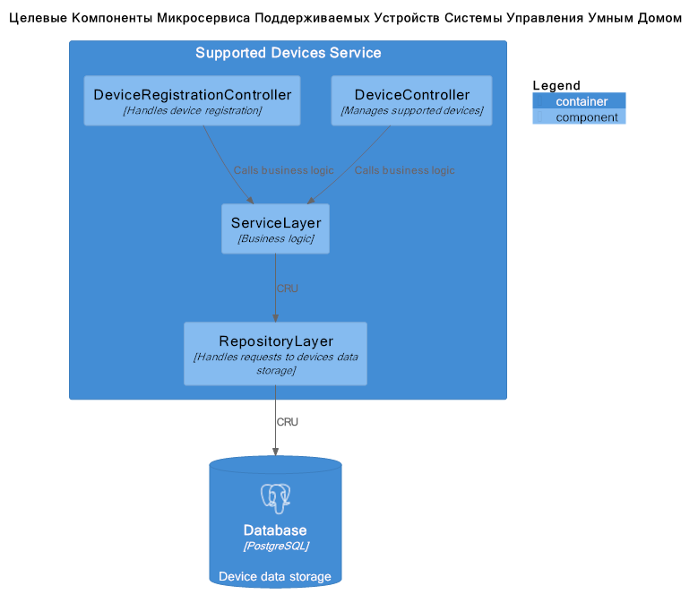

 

<h3>Диаграмма целевого состояния компонента DeviceAutomatizationTemplateService</h3> 
Сервис доступных автоматизаций/действий в рамках категорий поддерживаемых устройств. 

  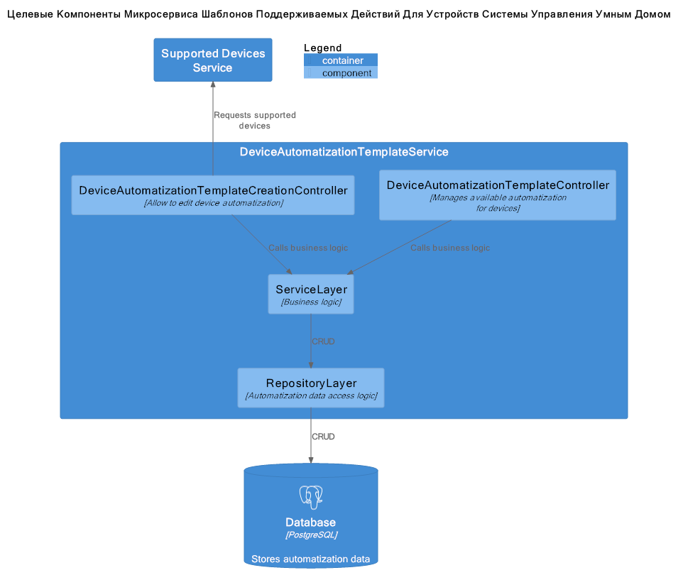

 

<h3>Диаграмма целевого состояния компонента UserService</h3> 
Сервис аутентификации и авторизации пользователей. 

  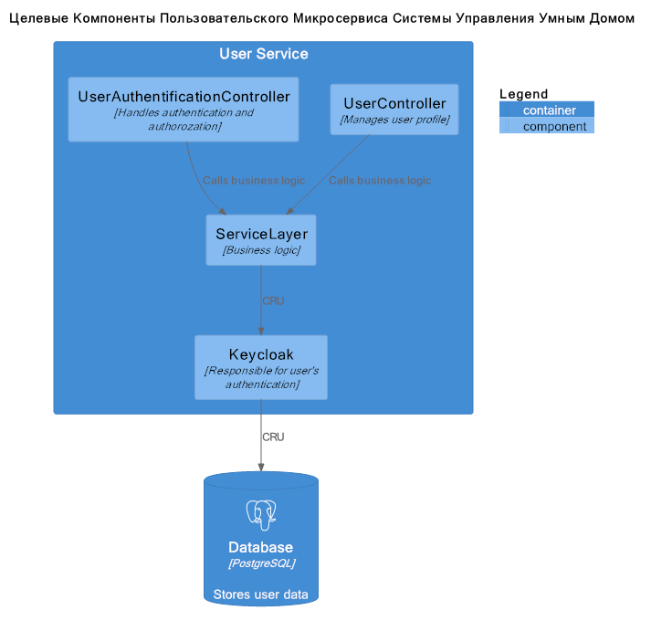

 

<h3>Диаграмма целевого состояния компонента UserDeviceService</h3> 
Сервис поддерживаемых системой зарегистрированных устройств пользователя. 

  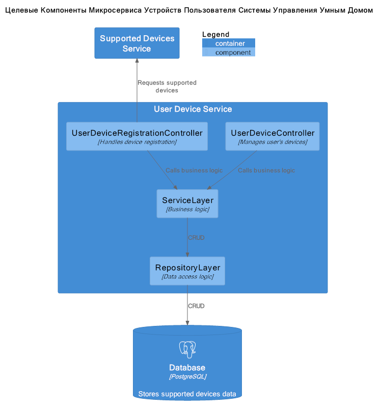

 

<h3>Диаграмма целевого состояния компонента UserDeviceTelemetryService</h3> 
Сервис телеметрии устройств пользовтаелей. 

  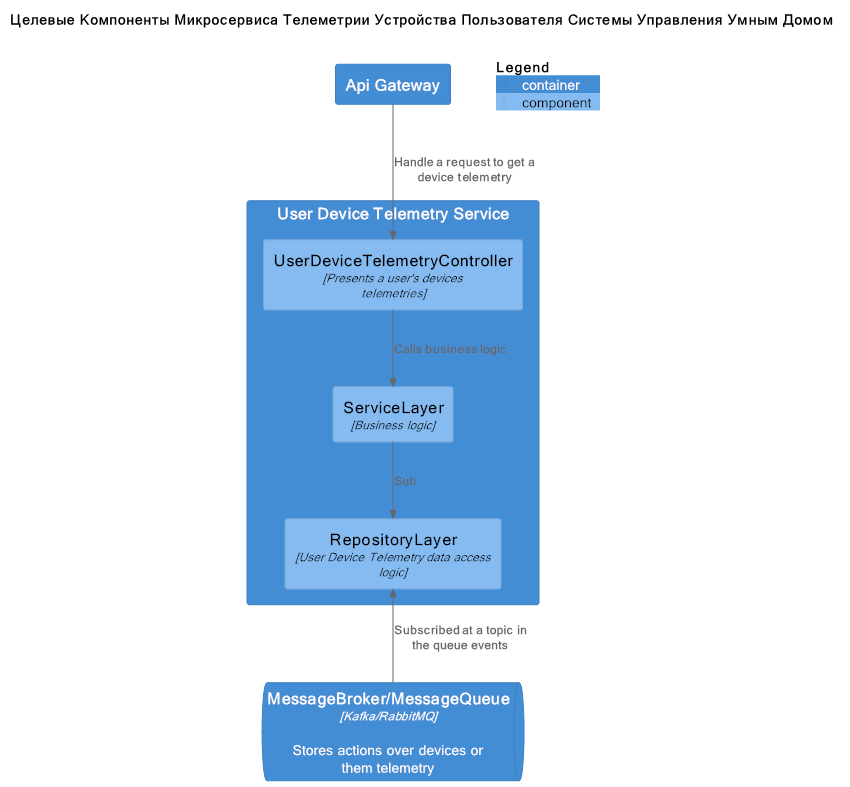

 

<h3>Диаграмма целевого состояния компонента UserAutomatizationService</h3> 
Сервис автоматизации событий (автоматических сценариев) настроенных пользователем, соответствующих допустимым для устройств. 

  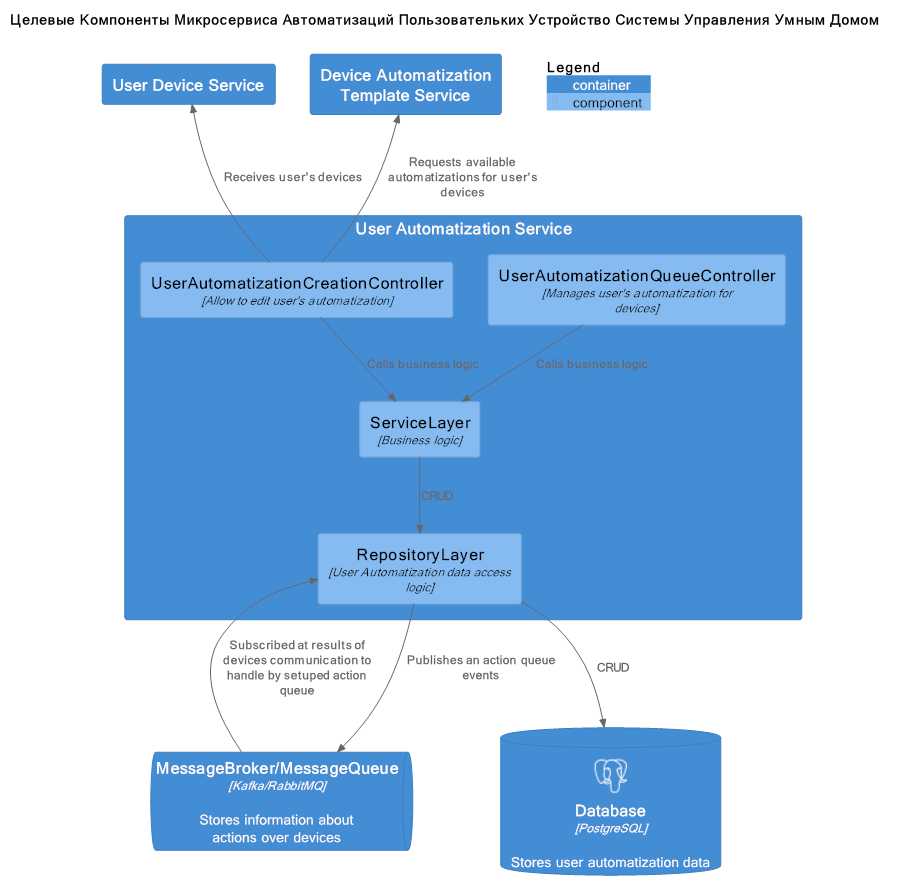

 

<h3>Диаграмма целевого состояния компонента UserCommunicationService</h3> 
Сервис коммуникации системы с конечными устройствами. 

  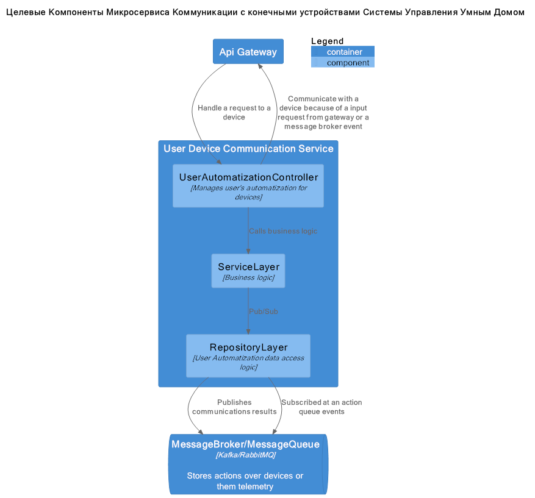

 

 

<h2>Диаграмма кода</h2>
 
<h3>Диаграмма целевого кода сервиса коммуникации</h3> 
Весь трафик во вне проходит через Apigateway. 

  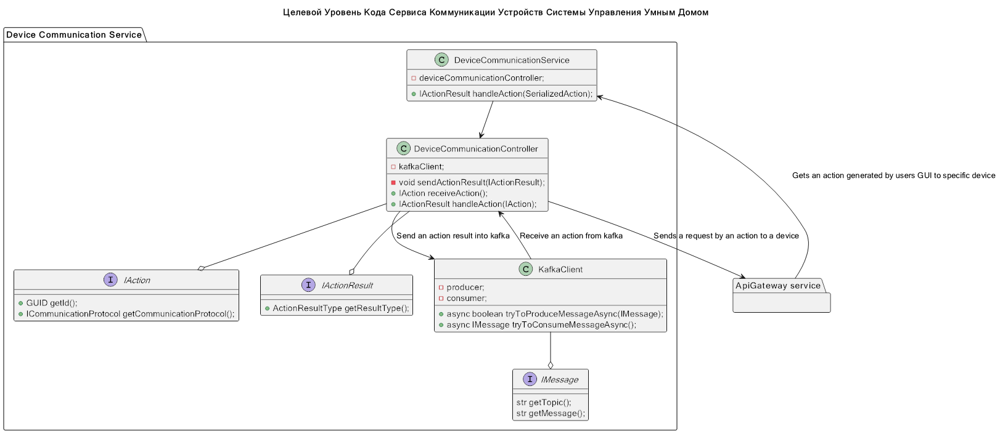

 

 

<h1>Задание 1.3</h1> 
ER диаграмма 

  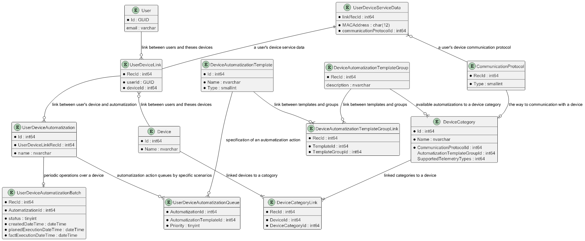

 

<h1>Задание 1.4</h1> 
Для взаимодействия между микросервисами используется RestApi. 
Ссылка на Swagger: <a href="Task1_4/swagger.yml">Task1_4/swagger.yml</a>. 

<h1>Задание 2.1</h1> 
Деплой осуществляется командой "docker compose up -d" 
Для проверки через swagger сконфигурируйте keycloak: 
1. Дождитесь старта keycloak; 
2. Зайдите в админку. Порт 18080. Логин admin, пароль аналогичный; 
3. Создайте рилм "shsmvp"; 
4. Создайте юзера, либо в параметрах рилма включите флаг отвечающий за взможность регистрации; 
5. Создайте клиент для данного рилма. В пункте "Valid redirect URIs" укажите любые пути от сервисов телемитрии и устройств пользователя (http://localhost:8080/* и http://localhost:8081/*). В пункте  укажите URL'ы сервисов телемитрии и устройств пользователя (http://localhost:8080 и http://localhost:8081). 
Включите Implicit flow в аутентификации данного клиента.  

Swagger поднят для сервисов.
http://localhost:8080/swagger/index.html - устройства пользователя
http://localhost:8081/swagger/index.html - телеметрия
При работе функции action сервиса устройств в кафку записывается сообщение-"рыба", сервис телеметрии подписан на данные сообщения. 
